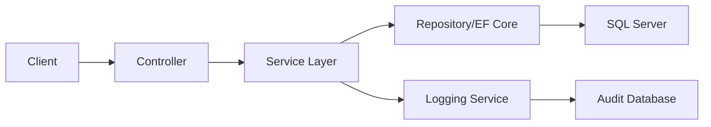

# 🔧 CAMS - Connection & Application Management System

<div align="center">

[](https://dotnet.microsoft.com/)
[](https://www.docker.com/)
[](https://docs.microsoft.com/en-us/ef/)
[](https://jwt.io/)
[](https://www.microsoft.com/en-us/sql-server)

*A robust, enterprise-grade API for managing database connections and applications with comprehensive security, logging, and monitoring.*

[🚀 Quick Start](#-quick-start) • [📖 API Documentation](#-api-documentation) • [🏗️ Architecture](#️-architecture) • [🔐 Security](#-security-features) • [🐳 Docker](#-docker-configuration)

</div>

---

## ✨ Features

### 🔐 **Authentication & Security**
- **JWT-based authentication** with refresh token support
- **Secure HTTP-only cookies** for token storage
- **Role-based access control** with user management
- **Comprehensive security event logging** with audit trails
- **IP address and user agent tracking** for security monitoring
- **Password strength validation** with BCrypt hashing
- **Email uniqueness validation** and availability checking

### 👤 **User Profile Management**
- **Complete profile management** with personal information updates
- **Secure password changes** with current password verification
- **Email address management** with availability validation
- **Account deactivation** with confirmation requirements
- **Profile statistics** including application and connection counts
- **User activity tracking** with last login timestamps

### 📊 **Application Management**
- **Create, update, and delete applications** with full CRUD operations
- **User-scoped application management** - each user manages their own applications
- **Application status management** (Active/Inactive toggle)
- **Environment and version tracking** with metadata support
- **Tag-based categorization** for application organization
- **Last accessed tracking** for usage analytics
- **Application-connection relationship management** with connection counts
- **Comprehensive audit logging** for all operations

### 🗄️ **Database Connection Management**
- **Multi-database support**: SQL Server, MySQL, PostgreSQL, Oracle, SQLite, MongoDB, Redis
- **API connection support**: REST API, GraphQL, WebSocket
- **Connection testing** with performance metrics and response times
- **Secure credential storage** with AES encryption
- **Connection status management** and health monitoring
- **Dynamic connection string building** with validation
- **Application-scoped connections** for better organization

### 📧 **Email Messaging System**
- **Send and receive emails** with rich HTML content support
- **Draft management** - save, edit, and send drafts
- **File attachments** with base64 encoding support
- **Email filtering and search** with advanced query options
- **Email statistics** and usage analytics
- **Priority levels** (Low, Normal, High, Urgent)
- **Read/unread status tracking** with timestamps
- **Bulk operations** for email management
- **Email validation** and address verification
- **Mailtrap.io integration** for development and testing

### 📝 **Enterprise Logging & Monitoring**
- **Structured logging** with correlation IDs
- **Security event tracking** for compliance
- **Audit trails** for all user interactions
- **Performance monitoring** with response time tracking
- **System log management** with error tracking
- **Comprehensive error handling** with detailed context

### 🛡️ **Clean Architecture & Best Practices**
- **MVC pattern** with clear separation of concerns
- **Dependency injection** throughout the application
- **Repository pattern** with Entity Framework Core
- **SOLID principles** implementation
- **DRY principle** with reusable components

---

## 🚀 Quick Start

### Prerequisites
- [.NET 8.0 SDK](https://dotnet.microsoft.com/download/dotnet/8.0)
- [Docker Desktop](https://www.docker.com/products/docker-desktop) (for containerized deployment)
- [SQL Server](https://www.microsoft.com/en-us/sql-server) (or Docker SQL Server)

### 🔧 Local Development

```bash
# Clone the repository
git clone <repository-url>
cd cams

# Restore dependencies
dotnet restore

# Update database connection string in appsettings.json
# Run Entity Framework migrations
dotnet ef database update

# Build the project
dotnet build

# Run the application
dotnet run
```

### 🐳 Docker Deployment

```bash
# Copy environment variables
cp .env.example .env

# Edit .env file with your settings
nano .env

# Build and run with Docker Compose
docker-compose up --build

# Run in background
docker-compose up -d
```

### 🌐 Access Points

| Service | URL | Description |
|---------|-----|-------------|
| **API** | http://localhost:8080 | Main API endpoints |
| **Swagger UI** | http://localhost:8080/swagger | Interactive API documentation |
| **Health Check** | http://localhost:8080/health | Application health status |
| **SQL Server** | localhost:1433 | Database server (Docker) |

---

## 📖 API Documentation

### 🔐 Authentication Endpoints

| Endpoint | Method | Description |
|----------|--------|-------------|
| `/login/authenticate` | POST | User login with credentials |
| `/login/refresh-token` | POST | Refresh JWT token |
| `/login/logout` | POST | User logout |
| `/login/validate` | GET | Validate current token |

**Example Authentication:**
```json
POST /login/authenticate
{
  "username": "platformadmin",
  "password": "PlatformAdmin123!"
}

Response:
{
  "token": "eyJhbGciOiJIUzI1NiIsInR5cCI6IkpXVCJ9...",
  "refreshToken": "abc123...",
  "expiration": "2024-07-10T15:30:00Z",
  "username": "platformadmin",
  "email": "platformadmin@cams.local",
  "userId": 1
}
```

### 👤 User Profile Management

| Endpoint | Method | Description |
|----------|--------|-------------|
| `/user/profile` | GET | Get complete user profile with statistics |
| `/user/profile/summary` | GET | Get condensed user profile |
| `/user/profile` | PUT | Update profile information |
| `/user/change-password` | POST | Change password with verification |
| `/user/change-email` | POST | Change email address |
| `/user/validate-password` | POST | Validate current password |
| `/user/check-email/{email}` | GET | Check email availability |
| `/user/deactivate` | POST | Deactivate user account |

**Password Requirements:**
- 8-100 characters long
- At least one uppercase letter
- At least one lowercase letter
- At least one digit
- At least one special character (@$!%*?&)

### 📊 Application Management

| Endpoint | Method | Description |
|----------|--------|-------------|
| `/application` | GET | List all applications |
| `/application/{id}` | GET | Get application details |
| `/application` | POST | Create new application |
| `/application/{id}` | PUT | Update application |
| `/application/{id}` | DELETE | Delete application |
| `/application/{id}/toggle` | PATCH | Toggle application status |
| `/application/{id}/connections` | GET | Get application connections |
| `/application/{id}/access` | POST | Update last accessed time |

**Application Environments:**
- Development (1)
- Testing (2)
- Staging (3)
- Production (4)
- Demo (5)

### 🗄️ Database Connection Management

| Endpoint | Method | Description |
|----------|--------|-------------|
| `/databaseconnection` | GET | List connections (with optional applicationId filter) |
| `/databaseconnection/{id}` | GET | Get connection details |
| `/databaseconnection` | POST | Create new connection |
| `/databaseconnection/{id}` | PUT | Update connection |
| `/databaseconnection/{id}` | DELETE | Delete connection |
| `/databaseconnection/test` | POST | Test connection |
| `/databaseconnection/{id}/toggle` | PATCH | Toggle connection status |
| `/databaseconnection/types` | GET | Get supported database types (no auth) |
| `/databaseconnection/connection-string/build` | POST | Build connection string |

**Supported Database Types:**
- **Relational**: SQL Server (1), MySQL (2), PostgreSQL (3), Oracle (4), SQLite (5)
- **NoSQL**: MongoDB (6), Redis (7)
- **API**: REST API (8), GraphQL (9), WebSocket (10)
- **Other**: Custom (99)

**Connection Status Types:**
- Untested (0) - Not yet tested
- Connected (1) - Working connection
- Failed (2) - Connection failed
- Testing (3) - Currently being tested

### 📧 Email Messaging System

| Endpoint | Method | Description |
|----------|--------|-------------|
| `/email/send` | POST | Send an email to recipients |
| `/email` | GET | List emails with filtering options |
| `/email/{id}` | GET | Get specific email details |
| `/email/sent` | GET | Get sent emails |
| `/email/drafts` | GET | Get draft emails |
| `/email/unread` | GET | Get unread emails |
| `/email/drafts` | POST | Save email as draft |
| `/email/drafts/{id}` | PUT | Update draft email |
| `/email/drafts/{id}/send` | POST | Send draft email |
| `/email/drafts/{id}` | DELETE | Delete draft email |
| `/email/{id}/read` | PUT | Mark email as read |
| `/email/{id}/unread` | PUT | Mark email as unread |
| `/email/{id}` | DELETE | Delete email |
| `/email/bulk` | DELETE | Delete multiple emails |
| `/email/stats` | GET | Get email statistics |
| `/email/attachments/{id}` | GET | Get attachment info |
| `/email/attachments/{id}/download` | GET | Download attachment |
| `/email/validate-email` | POST | Validate email address |

**Email Priority Levels:**
- Low (1) - Low priority emails
- Normal (2) - Standard priority (default)
- High (3) - High priority emails
- Urgent (4) - Urgent emails requiring immediate attention

**Email Status Types:**
- Draft (1) - Saved but not sent
- Queued (2) - Queued for sending
- Sending (3) - Currently being sent
- Sent (4) - Successfully sent
- Delivered (5) - Delivered to recipient
- Failed (6) - Failed to send
- Cancelled (7) - Sending cancelled

**Send Email Example:**
```json
POST /email/send
{
  "toEmail": "recipient@example.com",
  "toName": "John Doe",
  "ccEmails": "cc1@example.com,cc2@example.com",
  "subject": "Important Update",
  "body": "<h1>Hello</h1><p>This is an HTML email.</p>",
  "isHtml": true,
  "priority": 2,
  "attachments": [
    {
      "fileName": "document.pdf",
      "contentType": "application/pdf",
      "fileDataBase64": "JVBERi0xLjQKJeLjz9M..."
    }
  ]
}
```

**Email Search & Filtering:**
```bash
# Search emails by term
GET /email?searchTerm=project&page=1&pageSize=20

# Filter by status and date range
GET /email?status=4&fromDate=2024-01-01&toDate=2024-12-31

# Filter by sender/recipient
GET /email?fromEmail=admin@example.com&toEmail=user@example.com
```

### 📋 Complete API Usage Examples

<details>
<summary><strong>🔐 Complete Authentication Flow</strong></summary>

```bash
# 1. Login
curl -X POST http://localhost:8080/login/authenticate \
  -H "Content-Type: application/json" \
  -d '{"username": "platformadmin", "password": "PlatformAdmin123!"}'

# 2. Use token for authenticated requests
curl -H "Authorization: Bearer YOUR_JWT_TOKEN" \
  http://localhost:8080/user/profile

# 3. Refresh token when needed
curl -X POST http://localhost:8080/login/refresh-token \
  -H "Content-Type: application/json" \
  -d '{"username": "platformadmin", "refreshToken": "YOUR_REFRESH_TOKEN"}'

# 4. Logout
curl -X POST http://localhost:8080/login/logout \
  -H "Authorization: Bearer YOUR_JWT_TOKEN"
```
</details>

<details>
<summary><strong>👤 User Profile Management</strong></summary>

```bash
# Get full profile with statistics
curl -H "Authorization: Bearer YOUR_JWT_TOKEN" \
  http://localhost:8080/user/profile

# Update profile information
curl -X PUT http://localhost:8080/user/profile \
  -H "Authorization: Bearer YOUR_JWT_TOKEN" \
  -H "Content-Type: application/json" \
  -d '{"firstName": "John", "lastName": "Smith", "phoneNumber": "+1234567890"}'

# Change password
curl -X POST http://localhost:8080/user/change-password \
  -H "Authorization: Bearer YOUR_JWT_TOKEN" \
  -H "Content-Type: application/json" \
  -d '{"currentPassword": "admin123", "newPassword": "NewSecure123!", "confirmNewPassword": "NewSecure123!"}'

# Check email availability
curl -H "Authorization: Bearer YOUR_JWT_TOKEN" \
  http://localhost:8080/user/check-email/newemail@example.com
```
</details>

<details>
<summary><strong>📊 Application Workflow</strong></summary>

```bash
# 1. Create application
curl -X POST http://localhost:8080/application \
  -H "Authorization: Bearer YOUR_JWT_TOKEN" \
  -H "Content-Type: application/json" \
  -d '{
    "name": "E-commerce Platform",
    "description": "Main e-commerce application",
    "version": "1.0.0",
    "environment": "Development",
    "tags": "ecommerce,api,web",
    "isActive": true
  }'

# 2. Get all applications
curl -H "Authorization: Bearer YOUR_JWT_TOKEN" \
  http://localhost:8080/application

# 3. Get specific application with connections
curl -H "Authorization: Bearer YOUR_JWT_TOKEN" \
  http://localhost:8080/application/1

# 4. Update application
curl -X PUT http://localhost:8080/application/1 \
  -H "Authorization: Bearer YOUR_JWT_TOKEN" \
  -H "Content-Type: application/json" \
  -d '{
    "id": 1,
    "name": "Updated E-commerce Platform",
    "description": "Updated description",
    "version": "1.1.0",
    "environment": "Staging",
    "isActive": true
  }'

# 5. Toggle application status
curl -X PATCH http://localhost:8080/application/1/toggle \
  -H "Authorization: Bearer YOUR_JWT_TOKEN" \
  -H "Content-Type: application/json" \
  -d '{"isActive": false}'
```
</details>

<details>
<summary><strong>🗄️ Database Connection Management</strong></summary>

```bash
# 1. Get supported database types (no auth required)
curl http://localhost:8080/databaseconnection/types

# 2. Create SQL Server connection
curl -X POST http://localhost:8080/databaseconnection \
  -H "Authorization: Bearer YOUR_JWT_TOKEN" \
  -H "Content-Type: application/json" \
  -d '{
    "applicationId": 1,
    "name": "Production Database",
    "description": "Main production database",
    "type": 1,
    "server": "localhost",
    "port": 1433,
    "database": "EcommerceDB",
    "username": "sa",
    "password": "YourPassword123!",
    "isActive": true
  }'

# 3. Create REST API connection
curl -X POST http://localhost:8080/databaseconnection \
  -H "Authorization: Bearer YOUR_JWT_TOKEN" \
  -H "Content-Type: application/json" \
  -d '{
    "applicationId": 1,
    "name": "Payment Gateway API",
    "description": "External payment processing API",
    "type": 8,
    "apiBaseUrl": "https://api.stripe.com/v1",
    "apiKey": "sk_test_your_api_key_here",
    "isActive": true
  }'

# 4. Test existing connection
curl -X POST http://localhost:8080/databaseconnection/test \
  -H "Authorization: Bearer YOUR_JWT_TOKEN" \
  -H "Content-Type: application/json" \
  -d '{"connectionId": 1}'

# 5. Test new connection without saving
curl -X POST http://localhost:8080/databaseconnection/test \
  -H "Authorization: Bearer YOUR_JWT_TOKEN" \
  -H "Content-Type: application/json" \
  -d '{
    "connectionDetails": {
      "type": 1,
      "server": "localhost",
      "port": 1433,
      "database": "TestDB",
      "username": "testuser",
      "password": "testpass"
    }
  }'

# 6. Get connections filtered by application
curl -H "Authorization: Bearer YOUR_JWT_TOKEN" \
  "http://localhost:8080/databaseconnection?applicationId=1"

# 7. Build connection string
curl -X POST http://localhost:8080/databaseconnection/connection-string/build \
  -H "Authorization: Bearer YOUR_JWT_TOKEN" \
  -H "Content-Type: application/json" \
  -d '{
    "type": 1,
    "server": "localhost",
    "port": 1433,
    "database": "MyDB",
    "username": "user",
    "password": "password"
  }'
```
</details>

<details>
<summary><strong>📧 Email Messaging Workflow</strong></summary>

```bash
# 1. Send an email with attachment
curl -X POST http://localhost:8080/email/send \
  -H "Authorization: Bearer YOUR_JWT_TOKEN" \
  -H "Content-Type: application/json" \
  -d '{
    "toEmail": "colleague@company.com",
    "toName": "John Smith",
    "ccEmails": "manager@company.com",
    "subject": "Project Status Report",
    "body": "<h2>Project Update</h2><p>Please find the status report attached.</p>",
    "isHtml": true,
    "priority": 2,
    "attachments": [
      {
        "fileName": "report.pdf",
        "contentType": "application/pdf",
        "fileDataBase64": "JVBERi0xLjQKJeLjz9MKNCAwIG9iago8..."
      }
    ]
  }'

# 2. Save email as draft
curl -X POST http://localhost:8080/email/drafts \
  -H "Authorization: Bearer YOUR_JWT_TOKEN" \
  -H "Content-Type: application/json" \
  -d '{
    "toEmail": "draft@example.com",
    "subject": "Draft Email",
    "body": "This is a draft email to be sent later.",
    "isHtml": false
  }'

# 3. Send draft email
curl -X POST http://localhost:8080/email/drafts/1/send \
  -H "Authorization: Bearer YOUR_JWT_TOKEN"

# 4. Get email statistics
curl -H "Authorization: Bearer YOUR_JWT_TOKEN" \
  http://localhost:8080/email/stats

# 5. Search emails
curl -H "Authorization: Bearer YOUR_JWT_TOKEN" \
  "http://localhost:8080/email?searchTerm=project&page=1&pageSize=10"

# 6. Download attachment
curl -H "Authorization: Bearer YOUR_JWT_TOKEN" \
  http://localhost:8080/email/attachments/1/download \
  --output downloaded_file.pdf

# 7. Mark email as read
curl -X PUT http://localhost:8080/email/5/read \
  -H "Authorization: Bearer YOUR_JWT_TOKEN"

# 8. Delete multiple emails
curl -X DELETE http://localhost:8080/email/bulk \
  -H "Authorization: Bearer YOUR_JWT_TOKEN" \
  -H "Content-Type: application/json" \
  -d '[1, 2, 3, 4]'
```
</details>

---

## 🏗️ Architecture

### 📁 Project Structure

```
cams/
├── Backend/
│   ├── Controller/          # API endpoints (thin controllers)
│   ├── Services/           # Business logic and orchestration
│   ├── Model/              # Domain entities and data structures
│   ├── View/               # Request/Response DTOs
│   ├── Data/               # Entity Framework DbContext
│   ├── Configuration/      # Configuration classes
│   ├── Helpers/            # Utility functions and extensions
│   ├── Constants/          # String constants and configuration
│   ├── Enums/              # Type-safe enumerations
│   ├── Validators/         # Input validation logic
│   ├── Mappers/            # Data transformation classes
│   └── Exceptions/         # Custom exception classes
├── Tests/                  # Comprehensive test suite
├── Dockerfile              # Multi-stage Docker build
├── docker-compose.yml      # Complete development stack
└── README.md              # This file
```

### 🎯 Design Patterns & Principles

- **🏛️ Clean Architecture**: Clear separation between layers
- **🔄 Repository Pattern**: Data access abstraction with EF Core
- **💉 Dependency Injection**: Loosely coupled components
- **🛡️ SOLID Principles**: Maintainable and extensible code
- **📋 DRY Principle**: Reusable components and utilities
- **🔐 Security by Design**: Authentication, authorization, and audit logging

### 🔄 Request Flow



### 📊 Data Relationships

```
User (1) ──── (many) Application
Application (1) ──── (many) DatabaseConnection
User (1) ──── (many) AuditLog
User (1) ──── (many) SecurityLog
User (1) ──── (many) PerformanceLog
```

---

## 🔐 Security Features

### 🛡️ Authentication & Authorization
- **JWT tokens** with configurable expiration (60 minutes default)
- **Refresh token rotation** for enhanced security (7 days default)
- **HTTP-only cookies** to prevent XSS attacks
- **Role-based access control** (RBAC)
- **User isolation** - users can only access their own data

### 📊 Security Monitoring
- **Failed login attempt tracking** with IP logging
- **Security event logging** for compliance
- **User agent and IP address tracking**
- **Session management** with automatic cleanup
- **Brute force protection** with account lockout

### 🔒 Data Protection
- **AES-256 encrypted sensitive data** in database
- **Secure password hashing** with BCrypt
- **SQL injection prevention** with parameterized queries
- **CORS configuration** for cross-origin security
- **Sensitive data masking** in logs and responses

### 📋 Audit & Compliance
```json
{
  "userId": 123,
  "action": "LOGIN",
  "entityType": "AUTH_SESSION",
  "timestamp": "2024-07-10T14:30:00Z",
  "ipAddress": "192.168.1.100",
  "userAgent": "Mozilla/5.0...",
  "description": "User authentication successful"
}
```

**Security Event Types:**
- Login/Logout events
- Password changes
- Email changes
- Account lockouts
- Unauthorized access attempts
- Token generation/expiration
- Permission denied events
- Suspicious activity detection

---

## 🐳 Docker Configuration

### 🔧 Multi-Stage Dockerfile
- **Development stage**: Hot reload with debugging tools
- **Production stage**: Optimized runtime with security hardening
- **Health checks**: Automatic container health monitoring
- **Non-root user**: Security best practices

### 🏗️ Docker Compose Stack
```yaml
services:
  backend:    # .NET 8.0 API with hot reload
  db:         # SQL Server 2022
```

### 🚀 Development Commands
```bash
# Development with hot reload
docker-compose up --build

# Production deployment
docker-compose -f docker-compose.prod.yml up -d

# View logs
docker-compose logs -f backend

# Execute database commands
docker-compose exec db sqlcmd -S localhost -U sa
```

---

## 🔧 Configuration

### 🌍 Environment Variables

| Variable | Description | Default |
|----------|-------------|---------|
| `DB_PASSWORD` | Database password | `YourStrong!Passw0rd` |
| `JWT_SECRET_KEY` | JWT signing key | Auto-generated |
| `SMTP_HOST` | Email server host | `sandbox.smtp.mailtrap.io` |
| `ASPNETCORE_ENVIRONMENT` | Runtime environment | `Development` |

### ⚙️ Application Settings

<details>
<summary><strong>📄 appsettings.json</strong></summary>

```json
{
  "ConnectionStrings": {
    "DefaultConnection": "Server=localhost,1433;Database=CamsDb;User Id=sa;Password=YourStrong!Passw0rd;TrustServerCertificate=true"
  },
  "JwtSettings": {
    "Secret": "ThisIsAVerySecureSecretKeyForJWTTokenGeneration2024!",
    "Issuer": "cams-api",
    "Audience": "cams-client",
    "ExpirationMinutes": 60,
    "RefreshTokenExpirationDays": 7
  }
}
```
</details>

---

## 🧪 Testing

### 🔬 Running Tests
```bash
# Run all tests
dotnet test

# Run with coverage
dotnet test --collect:"XPlat Code Coverage"

# Run specific test class
dotnet test --filter "LoginControllerTests"

# Run with verbose output
dotnet test --verbosity normal
```

### 📊 Test Coverage
- **Unit Tests**: Controller and service layer testing
- **Integration Tests**: End-to-end API testing
- **Security Tests**: Authentication and authorization validation
- **Performance Tests**: Connection testing and response times

---

## 📈 Monitoring & Logging

### 📊 Comprehensive Logging System
The application implements a multi-layered logging system:

**Audit Logging** - Track all user interactions:
```json
{
  "userId": 123,
  "action": "CREATE",
  "entityType": "DATABASE_CONNECTION",
  "entityId": 456,
  "entityName": "Production DB",
  "description": "Created new database connection",
  "timestamp": "2024-07-10T14:30:00Z",
  "ipAddress": "192.168.1.100",
  "userAgent": "Mozilla/5.0..."
}
```

**Security Logging** - Monitor security events:
```json
{
  "userId": 123,
  "eventType": "LOGIN",
  "status": "SUCCESS",
  "description": "User logged in successfully",
  "timestamp": "2024-07-10T14:30:00Z",
  "ipAddress": "192.168.1.100",
  "severity": "Information"
}
```

**Performance Logging** - Track system performance:
```json
{
  "operation": "DATABASE_QUERY",
  "duration": "00:00:00.125",
  "controller": "DatabaseConnection",
  "action": "TestConnection",
  "userId": 123,
  "statusCode": 200,
  "timestamp": "2024-07-10T14:30:00Z"
}
```

**System Logging** - Application health and errors:
```json
{
  "eventType": "ApplicationStart",
  "level": "Information",
  "source": "Application",
  "message": "Application started successfully",
  "timestamp": "2024-07-10T14:30:00Z",
  "machineName": "web-server-01"
}
```

### 📝 Structured Logging Features
- **Correlation IDs** for request tracing
- **User context** in all user-initiated operations
- **IP address and user agent** tracking
- **Sensitive data protection** (no passwords or keys logged)
- **Configurable log levels** (Trace, Debug, Information, Warning, Error, Critical, Fatal)
- **Performance thresholds** with automatic alerting

---

## 🤝 Contributing

### 🎯 Development Guidelines
1. **Follow SOLID principles** and clean code practices
2. **Write comprehensive tests** for new features
3. **Update documentation** for API changes
4. **Use conventional commits** for clear history
5. **Ensure security best practices** in all code

### 📋 Code Standards
- **Controllers**: Thin controllers with only HTTP handling
- **Services**: Business logic and orchestration
- **Logging**: Comprehensive logging for all user interactions
- **Security**: Proper authentication and authorization
- **Testing**: Unit and integration test coverage
- **Validation**: Input validation at all entry points

### 🔧 Build Verification
Before submitting changes:
```bash
# Build without errors or warnings
dotnet build

# Run all tests
dotnet test

# Check code formatting
dotnet format --verify-no-changes

# Run security scan
dotnet list package --vulnerable
```

---

## 📄 License

This project is licensed under the [MIT License](LICENSE) - see the LICENSE file for details.

---

## 🆘 Support

### 📞 Getting Help
- **Issues**: Create an issue in the repository for bugs or feature requests
- **Health Check**: Visit `/health` endpoint to verify application status

### 🏥 Health Monitoring
```bash
# Check application health
curl http://localhost:8080/health

# Check with Docker
docker-compose exec backend curl -f http://localhost:8080/health
```

### 📋 Default Test Credentials
For development and testing purposes (seeded automatically):
- **Platform Admin**: `platformadmin` / `PlatformAdmin123!` (platformadmin@cams.local)
- **Admin User**: `admin` / `Admin123!` (admin@cams.local)
- **Regular User**: `user` / `User123!` (user@cams.local)

**Note**: These accounts are automatically created with proper role assignments during application startup.

---
